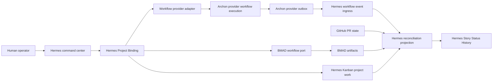
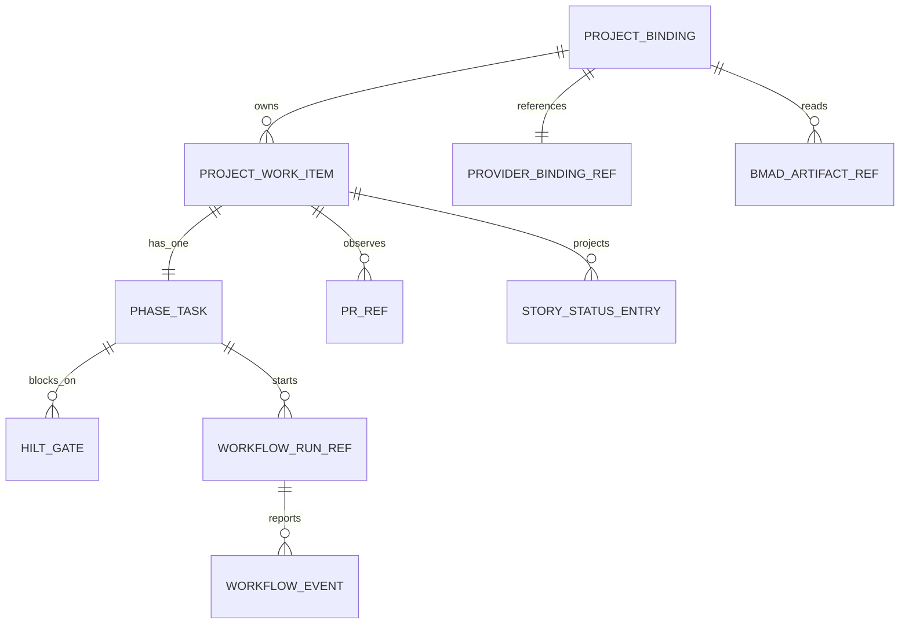

# Architecture: hermes-agent Slice For Hermes Agent Workflow Commander

## Scope

This is the `hermes-agent`-owned slice of the Hermes Agent Workflow Commander architecture — the majority of the system (command center, orchestration, reconciliation). The full spine (all 10 decisions, all subprojects) lives in the parent workspace; this file exists so no `hermes-agent` implementation agent needs to read it.

## Design Paradigm

Bounded Context + Ports and Adapters + Outbox/Reconciliation. `hermes-agent` is the human-facing command center and reconciliation owner. BMAD owns planning artifacts; workflow providers (Archon first) own execution primitives; GitHub owns PR/merge state; Hermes Kanban owns runtime project-work records while BMAD `sprint-status.yaml` stays a planning/audit artifact only.



## Architecture Decisions (all directly govern hermes-agent)

### AD-1 - Bounded contexts with ports, adapters, outbox, reconciliation [ADOPTED]
Hermes, BMAD, workflow providers, GitHub, and Kanban stay separately owned, connected only by explicit ports, machine contracts, and reconciliation records.

### AD-2 - Split Project Binding and Workflow Provider Binding ownership [ADOPTED]
Hermes owns the forward Project Binding: profile, cwd, GitHub context, BMAD mount, operational status, and headless user interaction. Each provider owns the reverse binding.

### AD-3 - Control providers through adapters, receive signed typed events [ADOPTED]
Hermes state-changing control uses a strict provider adapter capturing cwd (when applicable), stdout, stderr, exit code, timeout, correlation id, JSON result. Provider-to-Hermes mutation uses signed typed workflow events from an outbox, accepted only after schema, signature, replay, idempotency, profile, and binding checks. For provider `archon`, the adapter uses Archon CLI commands.

### AD-4 - Hermes Kanban is the runtime project-work owner [ADOPTED]
`sprint-status.yaml` is a BMAD planning/audit artifact only; Hermes materializes each BMAD story idempotently into a single phase task over canonical Kanban status plus gate metadata.

### AD-5 - Cross-system reconciliation under Hermes authority [ADOPTED]
Hermes owns the reconciliation projection across BMAD artifacts, project work, provider run state, GitHub PR state, workflow events, gate records. May auto-repair deterministic drift but must not auto-approve HILT gates or mark stories complete when evidence conflicts.

### AD-6 - Implementation ownership split by subproject [ADOPTED]
`hermes-agent` owns user/project orchestration, Project Binding, BMAD mount and materialization, Project Work Items, HILT Gates, Story Status History, reconciliation projection, provider adapter registration, provider command result consumption, workflow event ingress, and provider-neutral reconciliation.

### AD-7 - Version every cross-subproject machine contract [ADOPTED]
Workflow command envelopes, workflow event envelopes, provider binding records, delivery status records, and materialization idempotency records are JSON, schema-versioned, and compatibility-tested from shared examples before consumer implementation begins.

### AD-8 - Ratify brownfield stack, no new runtime infrastructure for v1 [ADOPTED]
`hermes-agent` stays on Python >=3.11,<3.14, FastAPI >=0.104.0,<1, Pydantic 2.13.4, Uvicorn >=0.24.0,<1, pytest 9.0.2, ruff 0.15.10, existing Kanban over SQLite WAL (workspace version 0.17.0).

### AD-9 - Contract-first, then split implementation [ADOPTED]
Implementation starts with shared examples and schemas for workflow command envelopes, event envelopes, Workflow Provider Binding shape, Project Work Item identity, Phase Task identity, materialization idempotency, callback rejection, and delivery-health cases.
The local Hermes handoff package now exists at `_bmad-output/planning-artifacts/contracts/workflow-commander/`.
Implementation stories still need compatibility tests that load these artifacts before they can be marked ready.

### AD-10 - Materialize isolated subproject planning handoffs before implementation [ADOPTED]
This file, `prd.md`, and `epics.md` are that materialization for `hermes-agent`.

## Consistency Conventions

| Concern | Convention |
| --- | --- |
| Controller naming | Workflow providers use generic `provider`/`name` vocabulary for external controller identity. |
| Hermes naming | Project Binding, Project Work Item, Phase Task, HILT Gate, Story Status History. |
| Binding direction | Hermes Project Binding points outward to cwd/GitHub/BMAD/provider metadata; provider binding points back to the event route. |
| Control direction | Hermes controls providers through adapters. Provider `archon` uses CLI only. |
| Event direction | Providers report events to Hermes through signed workflow event ingress. Archon uses a non-blocking outbox. |
| Data format | Cross-subproject contracts use JSON with explicit schema version and shared examples. |
| Command envelope | Every state-changing provider command result includes schema version, success flag, correlation id, run/binding reference, machine-readable result payload, machine-readable error shape. |
| Workflow event envelope | Every event includes schema version, event id, event type, occurred timestamp, provider binding reference, workflow run reference, project/codebase/provider execution context reference, signature metadata, idempotency key. |
| Project Work Item identity | Derived from bound project cwd, BMAD artifact path, BMAD epic/story identity. |
| Phase Task identity | Derived from Project Work Item identity plus phase kind. |
| Kanban lifecycle | Canonical status remains `triage`, `todo`, `ready`, `running`, `blocked`, `done`, `archived`. |
| Gate interaction surface | V1 uses durable pending-gate queries, authorized decision commands, and canonical `blocked` plus `gate_kind=done_verification`; existing transports may mirror notifications. |
| Completion semantics | Done requires Hermes done verification even when the provider workflow completed and GitHub PR state is favorable. |
| Drift handling | Deterministic drift may auto-repair; conflicting evidence routes to diagnostics and human decision. |

## Stack

| Name | Version |
| --- | --- |
| hermes-agent | 0.18.0 |
| Python | >=3.11,<3.14 |
| FastAPI | >=0.104.0,<1 |
| Pydantic | 2.13.4 |
| Uvicorn | >=0.24.0,<1 |
| pytest | 9.0.2 |
| ruff | 0.15.10 |
| SQLite library observed in local Python | 3.51.2 |

## Source Tree Seed (hermes-agent-owned files)

```text
hermes-agent/
  hermes_project_work/
    bindings.py              # Hermes Project Binding model and validation.
    bmad_mount.py             # Project-local BMAD skill mount integration.
    materialization.py        # sprint-status.yaml to Project Work Item projection.
    phase_tasks.py             # Single phase task model.
    gates.py                    # Done verification gate.
    workflow_providers/
      base.py                   # Provider adapter contract.
      archon.py                 # Archon provider adapter implementation.
    provider_commands.py        # Provider command result records.
    workflow_events.py          # Signed typed workflow event ingress.
    reconciliation.py           # Cross-system projection and diagnostics.
    story_status.py             # Structured status-history synthesis.
  tests/
    project_work/
```

**Note:** there is no `hermes-agent/web/` source tree seed because Workflow Commander v1 is explicitly headless.

## Core Entity Shape



## Operational Envelope

| Area | Boundary |
| --- | --- |
| Runtime | Hermes runs as its existing local process — no new runtime. |
| Persistence | Project Binding, project work, gate, workflow event receipt, and reconciliation records in Hermes's existing local substrate. |
| Network | Hermes-to-Archon control is local CLI execution. Provider-to-Hermes notification is a configured workflow event route with signature and replay checks. |
| Recovery | Reconciliation invoked manually or from workflow completion hooks; unresolved conflicts remain visible in Hermes. |

## Capability Map (hermes-agent-owned)

| Capability | Lives in | Governed by |
| --- | --- | --- |
| CAP-1 command center | Headless commands, Project Binding, Project Work Items | AD-1, AD-2, AD-4, AD-5 |
| CAP-2 BMAD invocation | BMAD workflow port and BMAD artifacts | AD-1, AD-4, AD-8 |
| CAP-3 project-local BMAD mount | Project Binding and profile skill mount | AD-2, AD-4 |
| CAP-4 provider control (consumer side) | Workflow provider adapters and command JSON consumption | AD-3, AD-7, AD-9 |
| CAP-6 human decisions | HILT gates and provider approval/rerun command calls | AD-3, AD-5, AD-7 |
| CAP-7 operational project work | Kanban plus Project Work Item metadata | AD-4, AD-5, AD-8 |
| CAP-8 sprint status materialization | Materialization service | AD-4, AD-7, AD-9 |
| CAP-9 phase tasks and gates | Phase task model and HILT gate records | AD-4, AD-5, AD-7 |
| CAP-10 story status history and reconciliation | Reconciliation projection and Story Status History | AD-5, AD-7, AD-9 |

## Implementation Validation Gates

| Contract Area | Owner | Gate Before Implementation |
| --- | --- | --- |
| Provider command JSON result schemas | Archon with Hermes consumer review | Seeded command envelope examples pass compatibility tests in both subprojects. |
| Workflow event signature metadata, replay window, and header names | Provider owner with Hermes security review | Seeded event and rejection examples pass signed, expired, duplicate, wrong-binding, and invalid-schema tests. |
| Exact Hermes Project Binding persistence schema | hermes-agent | Migration/uniqueness tests prove profile/cwd/GitHub/BMAD-mount/provider metadata cannot conflict. |
| Exact project-work, phase-task, gate, event-receipt, reconciliation tables | hermes-agent | Idempotency tests prove repeated materialization and duplicate events don't duplicate work/gates. |
| `sprint-status.yaml` field mapping and idempotency derivation | hermes-agent with BMAD artifact review | Seeded materialization fixtures cover missing, malformed, unchanged, changed, and duplicate phase-task cases. |
| Diagnostic and recovery vocabulary | hermes-agent with provider review | Seeded operational diagnostic examples cover binding conflict and unresolved completion evidence. |
| Gate decision audit shape | hermes-agent | Seeded gate-decision examples cover approval, rejection, evidence references, recovery action, and provider command separation. |
| Auto-pick and auto-continue policy | Product and hermes-agent | Policy tests prove no HILT gate is bypassed and no story starts without allowed authority. **Still genuinely open — no policy decided anywhere as of this handoff.** |

## Contract Readiness Dependencies

The shared contract fixtures every consumer story references now exist in the local handoff package at `_bmad-output/planning-artifacts/contracts/workflow-commander/`.
This resolves the missing-fixture planning blocker from the 2026-07-09 implementation-readiness report.
Do not mark a consumer story implementation-ready until its tests validate the exact schemas and examples it consumes, and do not claim integration completion until the matching Archon producer story emits compatible CLI JSON or signed workflow events.

## Validation Command

```text
cd hermes-agent
uv sync --extra dev
uv run pytest
uv run ruff check .
```

## Source

Derived from the parent workspace's canonical architecture and epics, current as of 2026-07-10 after the approved headless correction.
